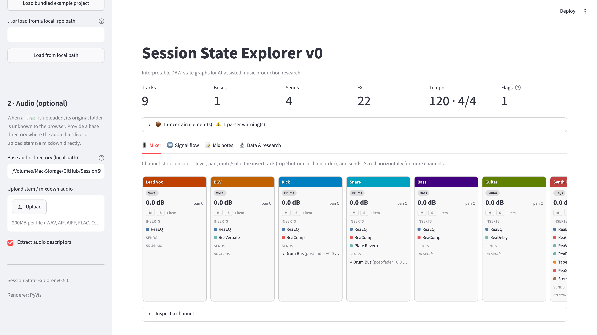
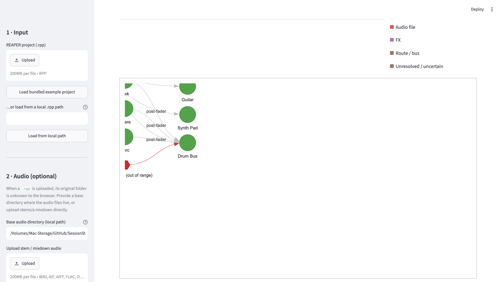
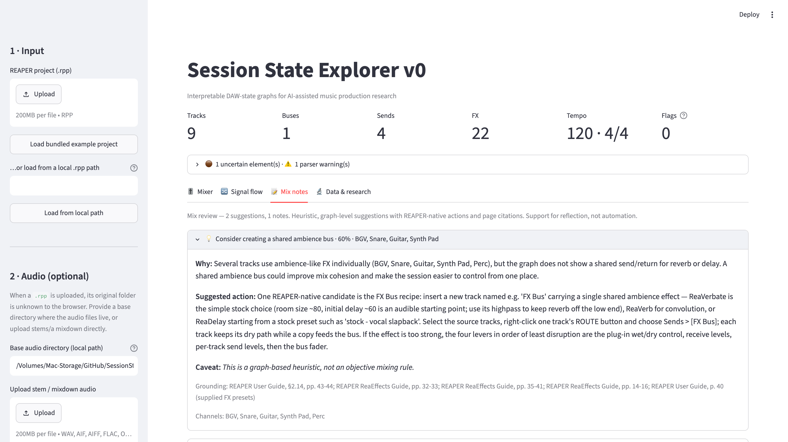
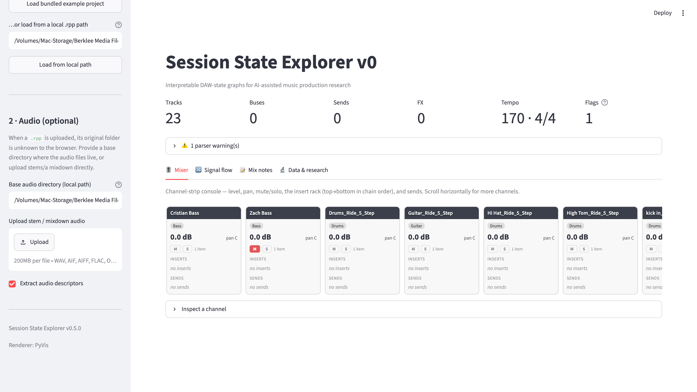

# Session State Explorer v0

[](https://github.com/ColonelKernel/session-state-explorer/actions/workflows/tests.yml)
[](https://github.com/ColonelKernel/session-state-explorer/releases)
[](pyproject.toml)
[](LICENSE)

**Interpretable DAW-state graphs for human-centered AI-assisted music production.**

Session State Explorer is a small research prototype that parses a [REAPER](https://www.reaper.fm/)
`.rpp` project into an **interpretable, partially observable graph** of its DAW state —
tracks, media items, audio files, FX chains, and routing — links that structure to simple
**audio descriptors**, and produces **explainable, caveated recommendations**. It is a
proof-of-fit artifact for doctoral research on DAW-state representation, developed in the
context of the Music Technology Group (Universitat Pompeu Fabra) and Steinberg.

> This prototype does not attempt to reconstruct a complete DAW session or replace the
> producer. It demonstrates how accessible DAW-state elements can be represented,
> inspected, and used for explainable assistance.

---

## 1. Research motivation

DAW sessions contain a great deal of structured production knowledge — how a mix is
organised into tracks and buses, which processors are applied where, and how material is
routed — but most AI music systems only ever see rendered audio or isolated parameters.
This prototype treats the **session itself** as a first-class, interpretable object: it
turns the accessible surface of a REAPER project into a typed graph that a human can read,
that an algorithm can reason over, and that is honest about what it could *not* observe.

## 2. Screenshots

The UI is organised around a mixing engineer's mental model — a channel-strip console,
a signal-flow graph, and a mix-review checklist — over a compact session overview band.

**Mixer console** — each track as a channel strip: level, pan, mute/solo, the insert rack
(in chain order, colour-coded by FX family), and sends. Horizontally scrollable.



**Signal flow** — the routing graph laid out left→right like a console (sources → buses →
master), with send modes on the edges and unresolved routes flagged in red. Replaces the
old force-directed view; a "Detail" resolution still offers the full graph.



**Mix notes** — recommendations as a severity-sorted review checklist. Each names concrete
REAPER stock plugins and workflows and carries page citations into the official guides.



The console scales to real sessions — here a **real 23-track REAPER 7 mix** (authored on
macOS); the overview band flags one stem on an unmounted drive, a genuinely partially
observable state surfaced rather than hidden.



## 3. Features

- **Tolerant `.rpp` parser** — a stack-based, line-oriented reader that extracts the
  human-meaningful surface of a session and records a warning for anything uncertain,
  rather than failing.
- **Interpretable DAW-state graph** — a typed `networkx` directed graph of project,
  tracks, media items, audio files, FX and routes.
- **Interactive visualization** — PyVis (draggable HTML) with an automatic Plotly
  fallback; node types are colour- and shape-coded with a legend and display filters.
- **Audio descriptors** — simple, interpretable acoustic features per audio file via
  `librosa` (optional, graceful when absent).
- **Explainable recommendations** — five rule-based heuristics, each with an explanation,
  a suggested action, related node ids, and an explicit caveat.
- **Session fingerprint & comparison** — a small structural fingerprint and a similarity
  measure between two exported sessions (stretch feature).
- **JSON export** — graph, descriptors, recommendations, and a full session document.

## 4. Installation

```bash
git clone <your-fork-url> session-state-explorer
cd session-state-explorer
python -m venv .venv && source .venv/bin/activate   # optional but recommended
pip install -r requirements.txt
```

Python 3.10+ is required. The audio and visualization layers are optional: if `librosa`
or `pyvis` is missing, the app still parses projects and builds graphs, and tells you what
is unavailable. You can also install via the package extras:

```bash
pip install -e .            # core only
pip install -e ".[full]"    # + audio (librosa, soundfile, pyloudnorm) and PyVis
pip install -e ".[test]"    # + pytest
```

## 5. Usage

Generate the bundled example data (synthetic stems + a matching project), then run the app:

```bash
python data/examples/make_example_data.py
streamlit run src/session_state_explorer/app.py
```

In the app:

1. Click **Load bundled example project** (or upload your own `.rpp`).
2. For audio, set the **base audio directory** (e.g. `data/examples`) or upload stems, then
   tick **Extract audio descriptors**.
3. Explore the summary, graph, tables, descriptors, recommendations, and exports.

## 6. Expected input

- A REAPER project file (`.rpp`, plain text).
- Optionally, the associated audio files (WAV/AIFF/FLAC/OGG/MP3/M4A) reachable via an
  absolute path, a path relative to the project, or a user-supplied base directory; or an
  uploaded stem/mixdown.

Because browser uploads do not expose the original folder, the app asks for a **base audio
directory** when resolving media referenced by an uploaded `.rpp`.

## 7. What the prototype extracts from `.rpp`

| Element       | Fields |
| ------------- | ------ |
| Project       | name, tempo + time signature, sample rate (+ enforced flag), authoring platform, warnings |
| Track         | name, heuristic role, volume (dB), pan / pan mode / pan law / width, mute, solo (+ raw solo mode, solo defeat), master/parent send, colour |
| Media item    | name, position, length, source type |
| Audio file    | source path (resolved when possible) |
| FX            | name, type (VST/JS/AU/CLAP/…), heuristic family, enabled/bypassed, offline, main vs. record chain, preset |
| Route         | source/target track, send vs. unresolved, send mode / level (dB) / pan / mute, raw line |

Plug-in-private parameter state is **not** decoded. FX are identified by name and a coarse
keyword family (EQ, Dynamics, Ambience, Saturation, Modulation, Pitch, Utility, Unknown).

Value semantics (volume scaling, solo modes, send modes, the custom-colour "in use" flag
and its OS-dependent byte order) follow the official REAPER extension SDK documentation.
Stock Cockos processors are identified via a guide-derived knowledge table
(`reaper_fx_knowledge.py`, page-cited); third-party plug-ins fall back to keyword
heuristics.

## 8. Graph schema overview

**Node types:** `project`, `track`, `media_item`, `audio_file`, `fx`, `bus_or_target`
(used for unresolved routes).

**Edge types:** `contains_track`, `contains_item`, `uses_audio_file`, `processes_with`,
`sends_to`, `has_unresolved_route`.

**Graph metadata:** track/item/FX/route counts, number of audio files, density, number of
unresolved (partially observed) elements, number of warnings.

## 9. Recommendation examples

Eleven heuristic rules, each producing a caveated `Recommendation`. Suggestions are
**REAPER-native and literature-grounded**: they name stock processors and canonical
workflows, and each carries page citations into the official REAPER User Guide and the
ReaEffects Guide (see `reaper_fx_knowledge.py`).

1. **Shared ambience bus** — several tracks use reverb/delay individually with no shared
   return → the User Guide's FX-Bus recipe (§2.14) with ReaVerbate / ReaVerb / ReaDelay
   on the return.
2. **Vocal chain** — a vocal-named track lacks common vocal-processing elements → stock
   candidates per missing element (ReaEQ, ReaComp with the guide's ballad settings,
   ReaFir-as-de-esser, an ambience send).
3. **Dense FX chain** — more than six processors → Performance Meter audit, offline vs.
   bypass, partial freeze, explicit parallel chains.
4. **Missing bus structure** — many tracks, no routing → folders vs. FX bus vs. VCA, with
   the guide's own preference.
5. **Level imbalance** — stems much hotter than the project median → JS Loudness Meter,
   preferring LUFS.
6. **All FX offline** — the fingerprint of REAPER's crash-recovery mode.
7. **Muted / near-silent sends** — routing edges that carry nothing (hygiene flag).
8. **Bypassed-but-online FX** — parked processors that still cost CPU → offline or freeze.
9. **Manual submix** — sources with master-send disabled converging on one bus → the
   guide-preferred folder-track structure.
10. **Clipping-risk stems** — source peaks at full scale → true-peak check, ReaLimit.
11. **Meters in the render path** — analysis-only plug-ins in ordinary chains → the
    Monitoring FX chain.

Example of a grounded suggestion (rule 9): _“Select the member tracks and right-click >
'Move tracks to folder' … folder volume/FX then govern the submix.”_ — Grounding:
_REAPER User Guide, §5.12-5.13, pp. 98-101._

Every recommendation ends with: _“This is a graph-based heuristic, not an objective mixing
rule.”_

## 10. Export format

```json
{
  "schema_version": "0.3.0",
  "project": { "...": "parsed ProjectState" },
  "graph": { "nodes": [], "edges": [], "metadata": {} },
  "descriptors": [],
  "recommendations": [],
  "fingerprint": {},
  "warnings": []
}
```

### Canonical snapshot bundles (`sse-reaper export-canonical`)

This repo is also the REAPER **observation instrument** for the cross-DAW
Session State Analyzer ("four observation instruments, one analysis
contract"). The `session_state_explorer.canonical_export` subpackage emits the
shared v0.2 wire format.

> **Optional feature.** The canonical adapter needs the `canonical-snapshot`
> contract package, which is **not on PyPI** and is obtained separately (it
> lives in the analyzer repo's `packages/canonical_snapshot`). The core
> Streamlit app and `pip install -e .` do **not** require it, and CI skips the
> canonical tests when it is absent — so this section only applies if you have
> a local checkout of the contract package.

```bash
# 1. Install the contract package from your local analyzer checkout (editable):
pip install -e /path/to/analyzer/packages/canonical_snapshot
# 2. Install this repo with the canonical extra:
pip install -e ".[canonical]"

sse-reaper export-canonical data/examples/example_project.rpp --out exports/example_project
```

This writes a deterministic, sanitized 5-file bundle —
`adapter_descriptor.json`, `capabilities.json`, `native.json` (the complete
native `ProjectState`, the losslessness guarantee), `canonical.snapshot.json`
(flat entities + relationships + provenance store, TRACK ≠ CHANNEL), and
`validation.json` — with an honest capability manifest (plug-in internals
INACCESSIBLE; automation/take FX/item fades/tempo map UNSUPPORTED; no
write/live/render pathways).

## 11. Limitations

- `.rpp` parsing is **partial** by design; it captures the accessible surface, not the full
  session.
- Plug-in state is **opaque**: FX are recognised by name/family only.
- Missing plug-ins or audio files may prevent full reconstruction; such gaps are flagged as
  warnings and as `bus_or_target` / unresolved nodes rather than hidden.
- Track colours are stored OS-natively; when the authoring platform cannot be read from the
  project header, the Windows byte order is assumed and a warning notes that red/blue may be
  swapped. Take FX, master-track FX and hardware output routing are detected but not
  modelled (each is surfaced as a warning).
- Audio descriptors are **simple summaries**, not mastering-grade measurements. Integrated
  loudness (LUFS) is computed only when `pyloudnorm` is installed.
- Recommendations are **heuristics for reflection**, not automated mixing decisions.

## 12. Relationship to the PhD proposal

The proposed research concerns **interpretable DAW-state graphs for human-centered
AI-assisted music production**. This prototype demonstrates the core building blocks: a
session can be parsed into a typed, partially observable state; represented as an
interpretable graph; linked to acoustic descriptors; and used to drive explainable,
caveated suggestions that keep the producer in control. See
[`docs/research_context.md`](docs/research_context.md) for the longer framing.

## 13. Roadmap

- A descriptor-triggered noise-reduction rule (ReaFir Subtract mode) once the
  low-dynamic-range / high-ZCR thresholds are calibrated against labelled stems.
- Broaden parser coverage (envelopes, take FX, item fades, tempo maps).
- Richer, validated audio descriptors and optional Essentia high-level features.
- Learned (not only rule-based) graph reasoning, evaluated with producers in the loop.
- Cross-DAW state ingestion and a shared, interpretable session schema.
- A curated corpus enabling structural retrieval over many session fingerprints.

## 14. License

[MIT](LICENSE).
